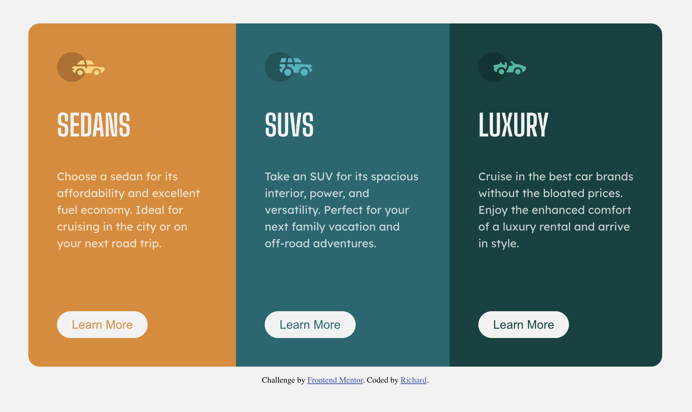

# Frontend Mentor - 3-column preview card component solution

This is a solution to the [3-column preview card component challenge on Frontend Mentor](https://www.frontendmentor.io/challenges/3column-preview-card-component-pH92eAR2-). Frontend Mentor challenges help you improve your coding skills by building realistic projects.

## Table of contents

- [Overview](#overview)
  - [The challenge](#the-challenge)
  - [Screenshot](#screenshot)
  - [Links](#links)
  - [Built with](#built-with)
  - [What I learned](#what-i-learned)
  - [Continued development](#continued-development)
- [Author](#author)

**Note: Delete this note and update the table of contents based on what sections you keep.**

## Overview

### The challenge

Users should be able to:

- View the optimal layout depending on their device's screen size
- See hover states for interactive elements

### Screenshot

### Links

- Solution URL: [https://github.com/r-tom90/Three-Column-Preview-Card-Component](https://github.com/r-tom90/Three-Column-Preview-Card-Component)
- Live Site URL: [https://r-tom90.github.io/Three-Column-Preview-Card-Component/](https://r-tom90.github.io/Three-Column-Preview-Card-Component/)

### Built with

- Semantic HTML5 markup
- CSS custom properties
- Flexbox

### What I learned

- Reminder of utilising "flex display, flex-direction: column-reverse;" CSS property to help with responsiveness to mobile sizes.

### Continued development

- Testing better methods of utilising css to get the required result. Flexbox has been my favorite method, but can not hurt to utilise grids.

## Author

- Frontend Mentor - [@CryptoFallen](https://www.frontendmentor.io/profile/CryptoFallen)
- Twitter - [@CryptoFallen](https://www.twitter.com/CryptoFallen)
